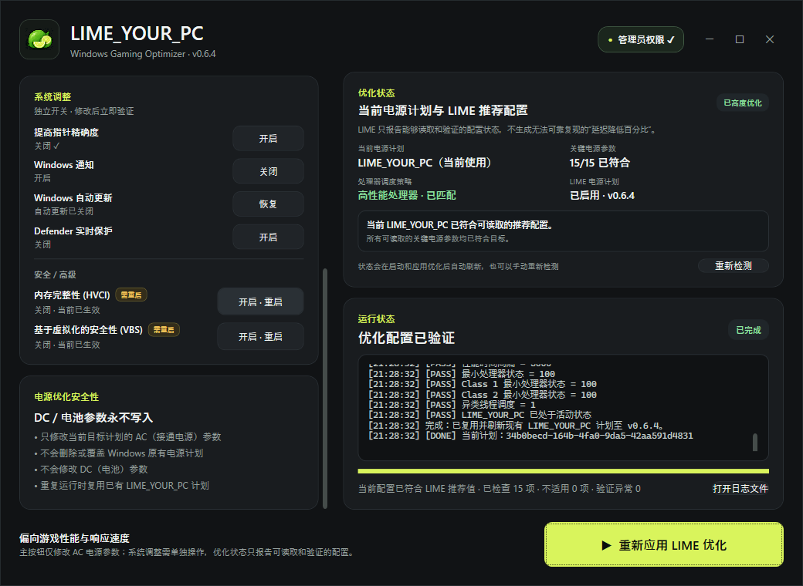

# LIME_YOUR_PC

一个面向 Windows 的轻量级电源计划优化工具。

LIME_YOUR_PC 会根据当前硬件平台创建并维护一个独立的高性能电源计划，主要针对游戏性能、系统响应速度以及接通电源时的处理器行为进行优化。

> 当前版本：**v0.4.0**

---

## ✨ 功能简介

LIME_YOUR_PC 目前主要针对 Windows 电源计划进行优化。

<p align="center">
  
</p>

程序会检测当前电脑的 CPU、设备类型和处理器拓扑，并根据不同硬件应用对应的优化规则。

目前支持的主要优化项目包括：

- USB 选择性暂停
- USB3 Link Power Management
- CPU 性能提升阈值
- Class 1 CPU 性能提升阈值
- CPU 核心停放
- Class 1 核心停放
- 处理器节流状态
- CPU Idle 阈值
- CPU 性能检测时间间隔
- 最小处理器状态
- Class 1 最小处理器状态
- Class 2 最小处理器状态
- 异构线程调度策略
- 接通电源时关闭显示器超时设置

---

## 🧠 硬件自适应

LIME_YOUR_PC 并不是简单导入一份固定电源计划。

程序会根据电脑的实际硬件环境动态应用部分参数。

### AMD CPU

异构线程调度策略设置为：

```text
All processors
```
### ICON
<p align="left">
  
</p>
